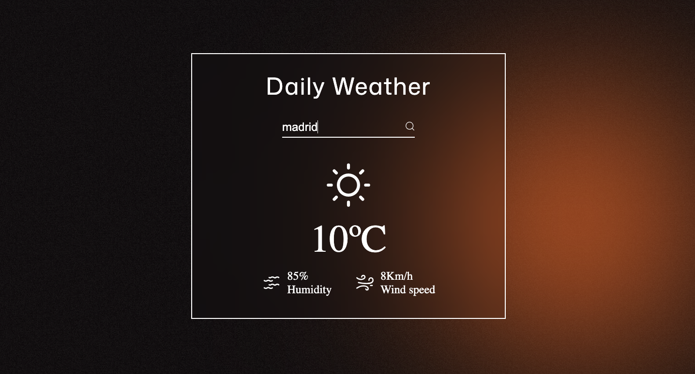

# Weather app
This is a weather application built using HTML, CSS, and JavaScript. The app allows users to search for a city and get real-time weather information, displayed with dynamic animations that visually represent different weather conditions. 

## Features

### Real-time Weather Data – Fetches live weather updates for any city.

### Animated Visuals – Dynamic animations change based on the weather:

-Warm, vibrant animations for hot weather 

-Cool, soothing animations for cold weather 

### User-Friendly UI – Simple and clean interface for an enhanced user experience.

### Fully Responsive – Works seamlessly on desktop and mobile devices.

## Technologies Used

### HTML5 – Structuring the application.

### CSS3 – Styling and animations for a dynamic experience.

### JavaScript (Vanilla JS) – Fetch API integration for real-time weather updates.

## Screenshots

## How to Use

### Enter a city name in the search bar.

### Click the search button to retrieve weather details.

### Enjoy the animated weather effects based on the conditions.

## Live Demo🚀 Hope you like it! :)
https://emedevelopa.github.io/Weather-app/ 

